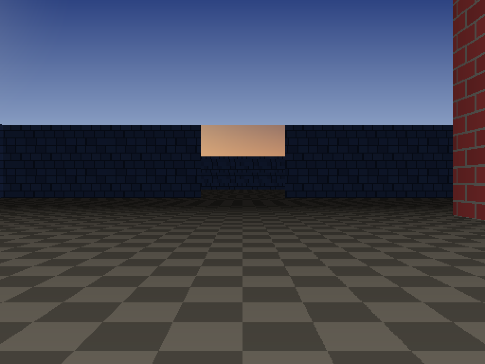
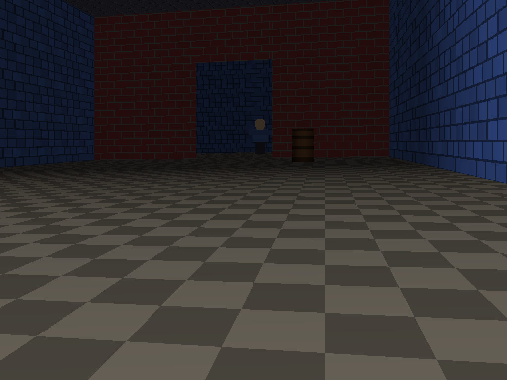
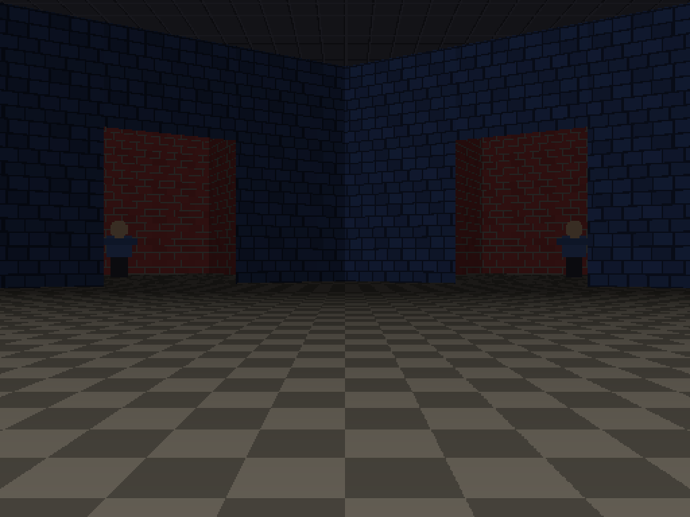
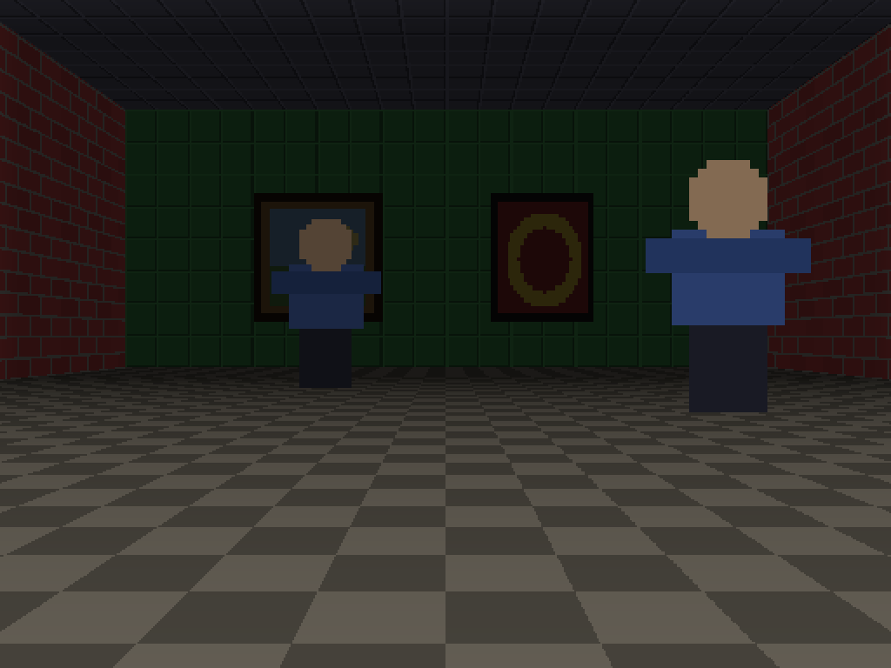
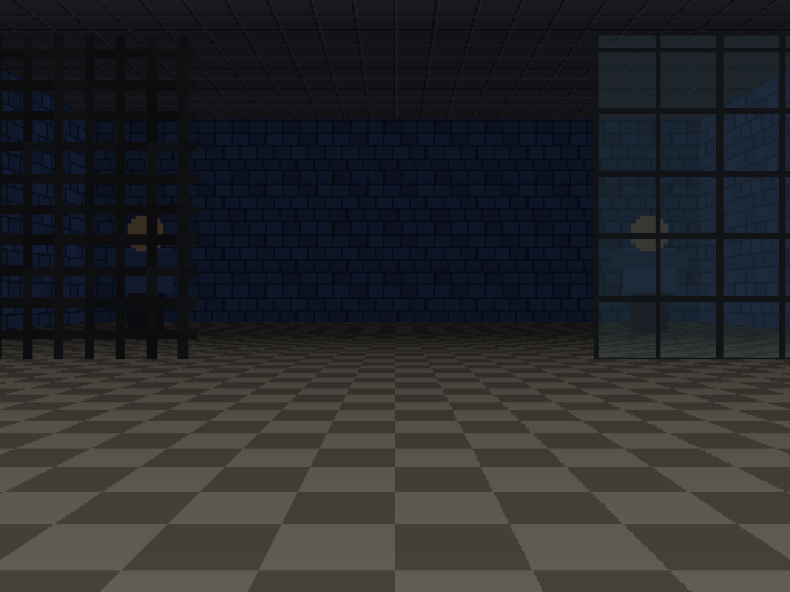
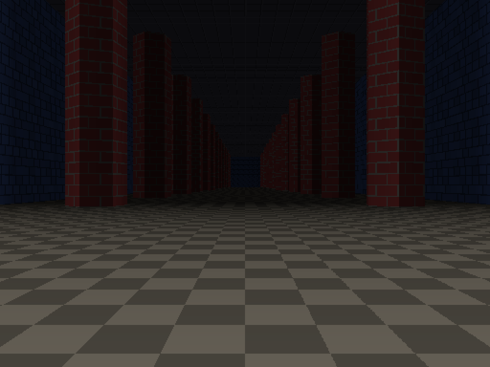
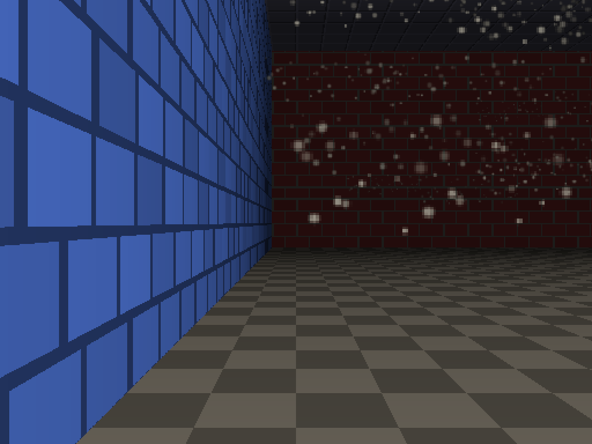
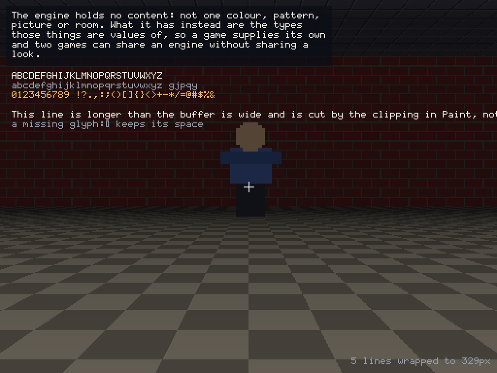

# CamlCast — a raycasting engine

[](https://github.com/pharick/camlcast/actions/workflows/ci.yml)
[](https://github.com/pharick/camlcast/actions/workflows/release.yml)
[](https://pharick.github.io/camlcast/)
[](https://ocaml.org)
[](LICENSE)


A first-person raycasting engine in OCaml on top of SDL2 (`tsdl`). A world is a
graph of rooms built from walls at any angle, each authored in its own coordinate
frame with its own inclined floor and its own ceiling or open sky, joined at
doorways you both see through and walk through. Walls carry their own heights and
materials, can be see-through, and can be hung with pictures; sprites stand in
the world facing the player; and there is mouse look with pitch. The floor,
ceiling and sky are cast per pixel by a small software renderer and the walls are
painted over them back to front.

This repository is the engine and the demos it is written against.

## What it looks like

<!-- Raw HTML because a markdown table has to have a header row, and this one has
     nothing to say in it. The widths are attributes rather than a stylesheet
     because GitHub strips those from a README, and without them a pair of
     1024-pixel screenshots would size the table past the column. -->
<table width="100%">
  <tr>
    <td width="50%"></td>
    <td width="50%"></td>
  </tr>
  <tr>
    <td></td>
    <td></td>
  </tr>
  <tr>
    <td></td>
    <td></td>
  </tr>
  <tr>
    <td></td>
    <td></td>
  </tr>
</table>

## Running

```sh
eval $(opam env --switch=. --set-switch)   # this repo uses a local switch
dune exec camlcast-demo                    # the list, on screen
dune exec camlcast-demo -- --list          # the same list, printed
dune exec camlcast-demo portals            # straight to one of them
dune test                                  # all suites
```

Named nothing, it opens the list in a window: arrow keys to move through it,
Enter to run what is highlighted, Escape to come back, over one slowly turning
room. Named a demo, it runs that one and nothing else — Escape then ends the
program, because there is nothing to come back to.

The demos that read art from files find it relative to the executable, which
under dune is `_build/default/assets/` — `dune build` puts it there. Installed,
it is `share/camlcast-demo/assets/` under the same prefix as the binary: the
share directory is named after the executable, so a game called `wanderer` reads
`share/wanderer`. Set `CAMLCAST_ASSETS` to a directory to look there instead,
and only there.

## The demos

One small world per engine feature, and one that has all of them at once. Each is
a single file under `demo/`, short enough to read in a sitting, with the feature
it demonstrates as the only thing in it — and each spawns you facing the thing it
is about.

| demo       | what it shows                                                  |
| ---------- | -------------------------------------------------------------- |
| `masonry`  | materials: one pattern function, applied at several colours    |
| `gallery`  | decals on the walls, sprites standing in the room              |
| `glass`    | see-through walls and the translucent pass                     |
| `slopes`   | inclined floors and roofs, and a seamless threshold            |
| `daylight` | the open sky, and two rooms under different ones               |
| `haze`     | atmosphere: the fade into fog and where the light falls        |
| `portals`  | doorways: the same room, joined in two places                  |
| `changing` | replacing a room: a sign that moves, rebuilt every frame       |
| `floating` | sprites off the floor, and frames chosen rather than made      |
| `dust`     | a chamber of falling dust: every mote moved every frame        |
| `chalk`    | marking a wall where the crosshair is, on the face you see     |
| `endless`  | the `extend` hook: a corridor built as you walk it             |
| `doors`    | doors that open and shut, on both sides of the link at once    |
| `barred`   | a door and a transom you can see through, and cannot walk past |
| `targets`  | what the crosshair is on, through the doorway in front of you  |
| `trail`    | traversal traces: a return route built from the doorways       |
| `phases`   | `Engine.run`: a phase, a clock, and a light going out          |
| `overlay`  | drawing over the finished world                                |
| `controls` | binding keys, press versus hold, and letting go of the mouse   |
| `text`     | a bitmap font: wrapping, measuring, clipping and colour        |
| `loading`  | art read from files, beside the generated kind                 |
| `showcase` | the five-room level, with all of the above at once             |

`demo/catalogue.ml` is the list itself, and `showcase` is `demo/level.ml`. Every
one of these worlds is checked by `test_demos`: that you can stand where it
spawns you, that its rooms enclose themselves, that every room is reachable, and
that no floor steps across a doorway. Adding a demo to `Catalogue.demos` is also
adding it to that suite.

## Two libraries

The engine holds no content — not one colour, pattern, picture or room. What it
has instead are the types those things are values of, so a game supplies its own
and two games can share an engine without sharing a look.

| directory | library         | what it is                                                     |
| --------- | --------------- | -------------------------------------------------------------- |
| `lib/`    | `camlcast`      | the engine: geometry, ray casting, rendering, SDL              |
| `demo/`   | `camlcast-demo` | the demos and the art they are made of, run by `camlcast-demo` |

Nothing in the engine depends on `demo/`, which is the point: it is content, and
it lives outside the library it is content for. It stays in this repository
because between them the demos exercise every corner of the engine — decals,
see-through walls, sloped floors, the open sky, growth, overlays and input — so a
change that breaks any of them breaks something you can walk through here.

They are two opam packages for the same reason. `camlcast` is the engine: a
library that reads no file and puts nothing in a prefix's `share`. `camlcast-demo`
is `bin/demo.ml` and the pictures it needs, which a program that reads its art
off the disk has to carry wherever it is installed.

## Using the engine

Pin it, since it is not on opam:

```sh
opam pin add camlcast git+https://github.com/pharick/camlcast.git
```

The demos are the second package and depend on the first, so a copy of them
wants both pinned — `opam install .` from a checkout does that in one step,
which is also what makes `camlcast-demo` resolve `camlcast` at all.

then `(libraries camlcast)` in your `dune`. A level is OCaml code rather than a
file in some format, so the smallest complete game is one room, a window and a
call:

```ocaml
open Camlcast

(* The engine ships no content, so a game brings its own: a pattern, the
   materials wearing it, and the air the world is seen through. *)
let checker ~color ~u ~v =
  Color.level color (if ((u / 16) + (v / 16)) land 1 = 0 then 240 else 170)

let dressed c = Material.make ~pattern:(Texture.generate (checker ~color:c))
let stone = dressed (Color.rgb 150 150 160)
and ground = dressed (Color.rgb 116 110 98)

let air =
  Atmosphere.make ~haze:(Color.rgb 24 24 32) ~fog_distance:12.
    ~min_brightness:0.25 ~light:(Vec.make (-0.4) (-0.9)) ~ambient:0.6
    ~directional:0.4

let world =
  let height = 4. in
  (* Counterclockwise, so every wall's normal faces into the room. *)
  let sw = Vec.make (-6.) (-6.) and se = Vec.make 6. (-6.)
  and ne = Vec.make 6. 6. and nw = Vec.make (-6.) 6. in
  let wall a b = Room.wall ~height ~material:stone a b in
  let floor = Plane.horizontal 0. in
  let room =
    Room.make
      ~floor:{ Room.plane = floor; material = ground }
      ~ceiling:(Room.Roof { Room.plane = Plane.above floor height; material = stone })
      [ wall sw se; wall se ne; wall ne nw; wall nw sw ]
  in
  World.make ~rooms:[ ("room", room) ] ~links:[] ~atmosphere:air
    ~spawn:("room", Vec.make (-4.5) 0.)

let () = ignore (Engine.with_window (fun window -> Engine.run_world window world))
```

`Engine.with_window` opens the window and closes it again when the function it
is given is done with it. `Engine.run_world` is the loop over the only state the
engine holds by itself: a world and the player walking it, plus an optional
`extend : World.t -> Player.t -> World.t` called once on any frame the player
went through a doorway on, with where they ended up. A game that keeps anything else — phases, doors, a journal, a
score, a random seed — uses `Engine.run` instead, which runs a state of whatever
type it likes and asks six things of it: `update`, `view`, `overlay`,
`pointing`, `finished` and `bindings` — the last being what the player's
controls are for, since the engine holds no keys any more than it holds colours.
Everything else stays on the game's side of the line, and the engine stays a
pure function of what it is handed.

A window and a run are two lifetimes and not one, which is why they are two
calls. A game with a single world to show never notices the difference. A
launcher does: it opens one window and plays run after run on it, so that
returning to its menu is the picture changing rather than the window vanishing
and coming back at the size it first had.

**[Making a game on CamlCast](https://pharick.github.io/camlcast/making-a-game.html)**
walks through all of that a feature at a time, with the demo that isolates each
one.

## Controls

The engine names no key of its own. Walking, looking, fullscreen and leaving the
run all come out of a `Binding.t` the game hands to `Engine.run`;
`Binding.default` is what the demos walk on, and it is a default and not a rule.

| key / device | action                                 |
| ------------ | -------------------------------------- |
| `W` / `S`    | walk forward / back                    |
| `A` / `D`    | strafe left / right                    |
| mouse        | look around (yaw and pitch)            |
| `←` / `→`    | turn left / right (keyboard fallback)  |
| `↑` / `↓`    | look up / down (keyboard fallback)     |
| `F11`        | toggle fullscreen                      |
| `Esc`        | leave the run (asked for, not default) |

Rebinding is a value:

```ocaml
let bindings =
  Binding.make
    ~forward:{ Binding.speed = 4.; terms = [ { source = Hold (Input.Key Key.i); weight = 1. } ] }
    ~leave:[ Input.Key Key.escape ]
    ()
```

An axis adds up terms, and a term is a source and a signed weight. A held key or
a stick is a **rate** — how hard the player is asking, between −1 and 1 — summed,
clamped, and paid out at the axis's speed over the frame. The mouse is a
**displacement**: it reports how far it has already moved, so it is added as it
stands rather than scaled by the frame again. That distinction is the seam a
gamepad would arrive through.

That last row is the one the engine will not assume. `Binding.default` binds _no_
key that ends a run, because a game with screens in it wants `Esc` for closing
them; `Engine.run_world` asks for it, since a bare world has nothing else to end it
with. Three demos add keys of their own — `phases` starts on `space`, `chalk`
marks on `C`, and `controls` binds a second set of walking keys and prints them
with `Key.name` — each says so at the top of its own file.

The mouse is captured in relative mode, so the cursor is hidden and never reaches
a screen edge.

The window is resizable and `F11` toggles borderless fullscreen. Reshaping it is
**Hor+**: the vertical field of view is fixed, so dragging the window wider
reveals more of the world to the sides instead of magnifying what was already on
screen, and pixels stay square at every shape.

## Bundles

Pushing a `v*` tag builds a bundle per platform and attaches it to a GitHub
release: a `.app` for macOS on Apple silicon and on Intel, a tarball for Linux
x64, a folder for Windows x64. Each carries its own SDL2 and image codecs, so
nothing has to be installed to run one. `tools/bundle-*.sh` build them, and can
be run on a laptop against a `dune build` tree.

A bundle opens on the list of demos, since a window that was double-clicked has
no command line behind it — that is the whole reason the list is drawn as well as
printed.

How old a Mac the `.app` runs on is decided by the machine that built it, not
chosen: the bundled libraries are Homebrew bottles, built for the runner's own
macOS. `bundle-macos.sh` reads the answer back out of the finished bundle and
records it as `LSMinimumSystemVersion`, so the exact version is in the `.app`'s
`Info.plist` and in the build log, rather than being promised here.

The Linux tarball has the same question and answers it the other way, by
choosing. It carries SDL2 and the image codecs but deliberately not glibc or the
dynamic loader — a binary has to use the loader it was built against — so the
runner's glibc is the floor for everyone who downloads it. The release job is
therefore pinned to a runner image rather than tracking the newest one, and the
tarball needs **glibc 2.39 or newer** (Ubuntu 24.04, Debian 13, Fedora 40). That
floor moves only when the pin in `.github/workflows/release.yml` does.

The `.app` is signed ad-hoc — which is what lets it run at all on Apple silicon,
where the kernel refuses an unsigned binary — but it is not notarized, so a Mac
that downloaded it refuses the first launch. Open System Settings → Privacy &
Security and choose "Open Anyway"; the Control-click trick that used to work was
removed in macOS 15. Or, once:

```sh
xattr -dr com.apple.quarantine camlcast-demo.app
```

## Modules

Each module is self-contained and depends only on the ones above it.

| module        | responsibility                                                                                                             |
| ------------- | -------------------------------------------------------------------------------------------------------------------------- |
| `Config`      | all tunable constants                                                                                                      |
| `Result_ext`  | `let*` / `let+` for chaining fallible SDL calls, and acquire/use/release                                                   |
| `Key`         | the keyboard, named by the engine: a binding is a place on the board, not a letter                                         |
| `Vec`         | immutable 2-D vectors, with the dot and cross products the geometry needs                                                  |
| `Transform`   | rigid rotations and translations between room-local coordinate frames                                                      |
| `Plane`       | an inclined floor/ceiling plane, and the per-pixel casting equation                                                        |
| `Color`       | 8-bit RGB, shading and blending                                                                                            |
| `Bitmap`      | decoding a PNG or JPEG into plain bytes: the one place pixel formats appear                                                |
| `Asset`       | where a file is, searched relative to the executable rather than to a source tree                                          |
| `Texture`     | colour surface patterns, generated or loaded, and the wrapping value noise they are built from                             |
| `Material`    | what a surface is made of: its pattern, and so whether you see through it                                                  |
| `Door`        | a leaf hung in a doorway: open or closed, and what it is made of                                                           |
| `Atmosphere`  | the air a world is seen through: its fog, its haze, and where its light comes from                                         |
| `Sky`         | the open sky drawn where a room has no roof — a directional gradient with a sun                                            |
| `Image`       | full-colour images with alpha, for wall decals and sprites                                                                 |
| `Paint`       | clipped rectangles, lines and pictures drawn over a finished frame                                                         |
| `Font`        | a bitmap font on a fixed grid: cell lookup, measuring, wrapping and drawing                                                |
| `Room`        | one independently-authored level: walls, thresholds, surfaces, ceiling or sky, sprites and collision                       |
| `World`       | named rooms, linked portals, the world's air and spawn, and the three primitives a world grows by                          |
| `Ray`         | ray-versus-segment intersection; every wall the ray crosses, farthest first                                                |
| `Player`      | camera pose: `pos` + unit `dir` + unit `right` + `pitch`; movement with wall sliding                                       |
| `Viewport`    | window size → camera geometry, projection, eye height and the pitch shear; the resize rules                                |
| `Sight`       | what the crosshair is on, traced through doorways and named by index                                                       |
| `Input`       | the keyboard and the mouse as they are: controls, their edges and holds, and what the analog sources read                  |
| `Binding`     | what those controls are for — the game's table, and the one pure function that turns a frame of them into a movement       |
| `Framebuffer` | a CPU pixel buffer (with alpha blending) and per-pixel depth, and the streaming texture it uploads through                 |
| `Renderer`    | the software renderer: floor/ceiling/sky, opaque walls with decals, then sprites and see-through walls composited by depth |
| `Engine`      | window lifetime, fullscreen state, and the game loop played on one                                                         |
| `Clock`       | the pacing arithmetic the loop measures its frames by, apart from any window                                               |

## Documentation

The modules are documented with odoc comments (`(** ... *)`), and the maths
derivations live there rather than in this file. Every push to `main` publishes
them, along with both guides:
**[pharick.github.io/camlcast](https://pharick.github.io/camlcast/)**.

- **[Making a game on CamlCast](https://pharick.github.io/camlcast/making-a-game.html)**
  — from an empty directory to a game, one engine feature at a time.
- **[Building the engine from scratch](https://pharick.github.io/camlcast/building-the-engine.html)**
  — how the picture is drawn, rebuilt by hand with every derivation written out.

To read them from a working tree instead:

```sh
opam install odoc            # once
dune build @doc
python3 tools/pages-site.py  # lays the tree out, and copies doc/images/ in
open _site/index.html
```

The second step is what CI publishes from, and it is needed rather than optional:
dune's `documentation` stanza has no way to carry assets, so the screenshots the
guides are illustrated with reach the site through `tools/pages-site.py` and not
through `@doc`. Opening `_build/default/_doc/_html/index.html` directly still
works, with every picture in it broken.

`doc/index.mld` is the landing page and the two guides are `.mld` pages beside
it; `doc/demo/index.mld` is the demos' own, in its own directory because it
belongs to the other package — a `.mld` page can only name what its package's
libraries bring in scope, and the engine does not depend on the demos. Both
libraries have a public name, which is what makes `@doc` pick their modules up
(odoc skips private libraries), so odoc writes one directory per package and
`tools/pages-site.py` roots the site at `camlcast` and carries `camlcast-demo`
across beneath it.

The pictures the guides and this file are illustrated with live in `doc/images/`.

`@doc` prints a warning for every `@raise` tag naming a standard-library
exception — `Invalid_argument` wherever one is refused, and
`Fun.Finally_raised` in `Result_ext`. odoc reads a `@raise` argument as a
reference, and the classic
`@doc` alias puts only this project's packages and their direct dependencies on
its resolution path, so nothing in `Stdlib` can resolve there; writing
`Stdlib.Invalid_argument` does not help, and `[Invalid_argument]` silences it
only by demoting the tag to a code span and losing the raise contract with it.
The site builds and every link inside it resolves. **That set of warnings is the
expected output** — anything else in it is a real reference that has gone stale.
`@doc-new`, the odoc 3 driver alias that would put `Stdlib` in scope, does not
build in this tree.

## Tests

[Alcotest](https://github.com/mirage/alcotest), one executable per module in
`test/`, covering both libraries. They share `Support`, a small library of its
own in the same directory, which holds a hand-checkable 4x4 square room, a pair
of rooms joined through a doorway, and the custom testables — a failing `Vec`
check prints `(3, 2.5)` rather than a bare `false`.

The suites are two stanzas, one per package, so that each package's tests build
from that package alone: `dune runtest` runs all of them, and the `-p` build
opam does runs only the ones belonging to the package it is building.

```sh
dune exec test/test_player.exe -- --verbose   # one suite
dune exec test/test_ray.exe -- test hits      # one group
```

**Nothing here opens a window.** `Framebuffer.offscreen` builds a buffer with no
streaming texture behind it, and `Renderer.draw_frame` fills a buffer with no SDL
call in it. So `test_paint` and `test_font` draw and read the pixels back, and
`test_renderer` renders whole frames: where a billboard lands, what a low wall
hides of it, and what a doorway trims it to are checked on the pixels rather than
only in the arithmetic that feeds them.

`test_level.ml` is the closest thing to an integration test: it checks the
showcase world the way a player meets it, so an engine change that breaks
portals, sloped floors or the sky fails there rather than in a unit suite.

## License

MIT — see [LICENSE](LICENSE).
